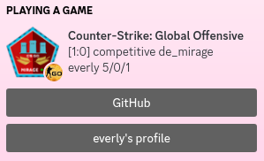
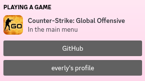

# CS:GO RPC GSI

Program that shows CS:GO's gamestate as Discord RPC

# How to Use

 * Copy `gamestate_integration_everly.cfg` to `<CS:GO Install Location>/csgo/cfg/`
 * Edit `config.py` to have your Steam ID
 * Run `csgo-rpc-gsi.py`

# Screenshots

This is what it will look like on your Discord profile.

### In-Game

### Main Menu

